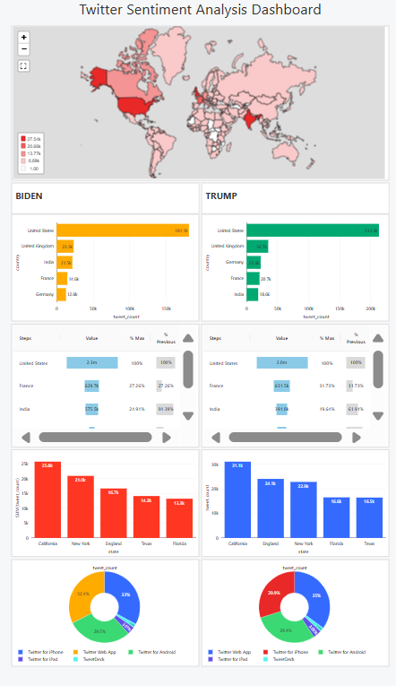

# 🗳️ Twitter Sentiment Analysis: 2020 US Election

  

## 📌 Project Overview
This project analyzes **public sentiment** on Twitter during the **2020 US Presidential Election**, focusing on tweets about **Donald Trump** and **Joe Biden**. By leveraging **big data analytics** and **machine learning**, we examine sentiment distribution, geographical engagement, and tweet sources to uncover key insights into online political discourse.

## 🔧 Tools & Technologies Used
This project utilizes **cloud-based big data processing** and **machine learning pipelines** to handle large-scale Twitter datasets.

| **Technology**         | **Purpose** |
|------------------------|-------------|
| **Azure Data Lake Storage (ADLS)** | Stores raw and processed Twitter data for scalable access. |
| **Azure Databricks**  | Provides a cloud-based collaborative platform for big data analytics, data processing, and machine learning. |
| **Apache Spark (PySpark)** | Enables fast and distributed data processing for handling large tweet datasets. |
| **MLlib (Spark Machine Learning Library)** | Used for feature extraction, vectorization, and model training. |
| **Databricks** | Creates visualizations for exploratory data analysis (EDA). |
| **Scikit-learn** | Trains and evaluates machine learning models for sentiment classification. |

## 🚀 Project Workflow

### **1️⃣ Data Ingestion & Storage**
- **Source**: Collected **4.1 million tweets** related to the 2020 US election.
- **Storage**: Data stored in **Azure Data Lake Storage (ADLS)** for scalability.

### **2️⃣ Data Processing & Preprocessing**
- **Executed on Azure Databricks** using **Apache Spark (PySpark)**.
- **Data Cleaning**: Removed hashtags, URLs, emojis, and special characters.
- **Tokenization**: Broke tweets into individual words for analysis.
- **Stopword Removal**: Eliminated common words that don’t add significant meaning.

### **3️⃣ Exploratory Data Analysis (EDA) & Visualization**
- Conducted on **Databricks Notebooks** with **Matplotlib & Seaborn**.
- **Key Insights:**
  - **Geographical Trends**: The **USA had the highest engagement**, followed by the **UK, India, and France**.
  - **Sentiment Analysis**: **Biden had more positive tweets**, while **Trump had a higher overall tweet count**.
  - **Tweet Sources**: Most tweets originated from **Twitter Web App, iPhone, and Android**.

### **4️⃣ Machine Learning Model Training**
- **Feature Engineering**: Used **TF-IDF**, **HashingTF**, and **Vectorization**.
- **Models Trained:**
  - **Logistic Regression** (Accuracy: **85.34%**)
  - **Random Forest** (Accuracy: **61.22%**)
  - **Support Vector Machine (SVM)** (Best Accuracy: **87.48%**)

### **5️⃣ Sentiment Classification & Insights**
- **Prediction Results:**
  - **Donald Trump**: **77,336 positive** tweets, **135,927 negative** tweets.
  - **Joe Biden**: **75,512 positive** tweets, **105,625 negative** tweets.
- **Conclusion**: Social media sentiment **aligned with the election outcome**, where Biden had a higher proportion of **positive sentiment**.

## 📊 Key Findings
✅ **Donald Trump was mentioned more frequently**, but **Joe Biden had a greater proportion of positive tweets**.  
✅ **SVM performed best**, making it the most effective model for sentiment classification.  
✅ **Twitter sentiment trends** provided a **strong correlation** with **real-world election outcomes**.  

## 💡 Future Enhancements
- **Expand dataset** beyond Twitter (Reddit, Facebook, news articles).
- **Implement real-time sentiment tracking** with streaming data.
- **Use deep learning models** (LSTMs, Transformers) for more advanced NLP.

## 📜 Conclusion
This project showcases the power of **big data analytics**, **machine learning**, and **social media analysis** in understanding **public opinion**. The results offer valuable insights into how **political sentiment on Twitter** influences **real-world election outcomes**. With further improvements, this methodology can be applied to **different political events**, **market trends**, and **public perception analysis**.

---
